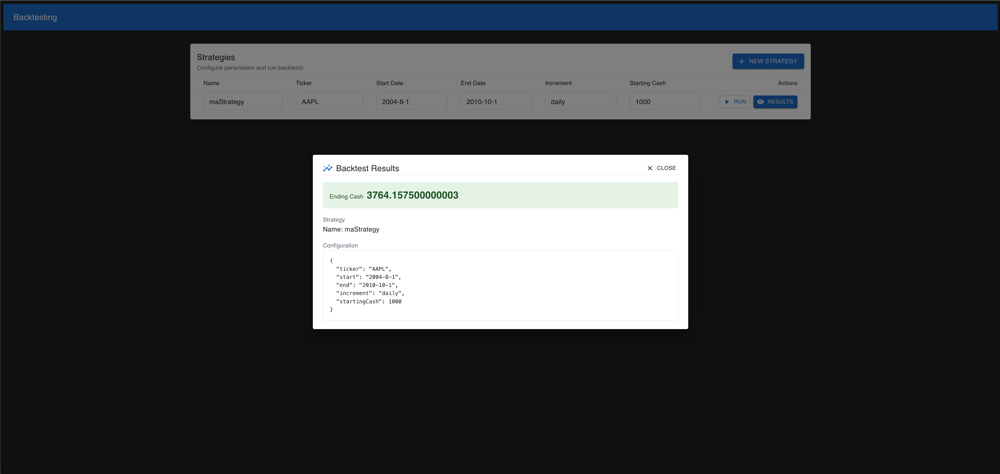

# Quantitative Platform

A lightweight backtesting platform with a Go backend and a React (Vite + MUI) frontend. Create strategies, run backtests, and view results in the UI.

- Backend: serves REST endpoints for strategies and backtest jobs (list, create, run, get results). Listens on http://localhost:8080.
- Frontend: React app for managing strategies and viewing results. Talks to the backend at http://localhost:8080.

## Example

Here is an example of the application being used, backtesting AAPL using the moving average strategy:



## Repository structure

- backend/ — Go API server and backtesting engine
- frontend/ — React UI (Vite, Material UI)
- docs/ — documentation and notes

## Prerequisites

- Go (recent 1.x)
- Node.js and npm
- air (optional but required by backend/pipeline.sh)
  - The backend pipeline uses the Air live-reload tool. If you don’t have it installed, install it first (for example: `brew install air` or `go install github.com/cosmtrek/air@latest`).

## Running the apps

Open two terminals.

1. Start the backend (port 8080):

```sh
cd backend
./pipeline.sh
```

This runs the Go server with Air. If you prefer without Air, you can run `go run .` instead.

2. Start the frontend (Vite dev server, typically http://localhost:5173):

```sh
cd frontend
./pipeline.sh
```

The frontend is configured to call the backend at http://localhost:8080 (see `frontend/src/Fetch.ts`). If you change the backend port, update those URLs accordingly.

## Notes

- Strategy parameters and backtest configuration are editable directly in the table UI. “Run” posts the job; “Results” opens a dialog once the result is available.
